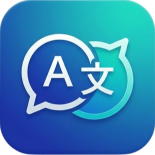
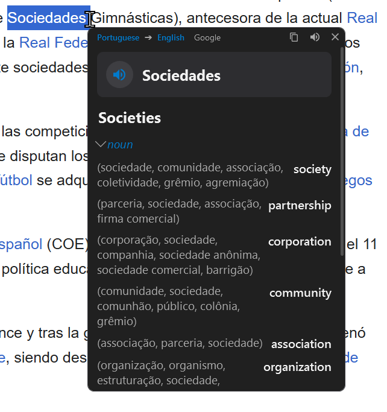
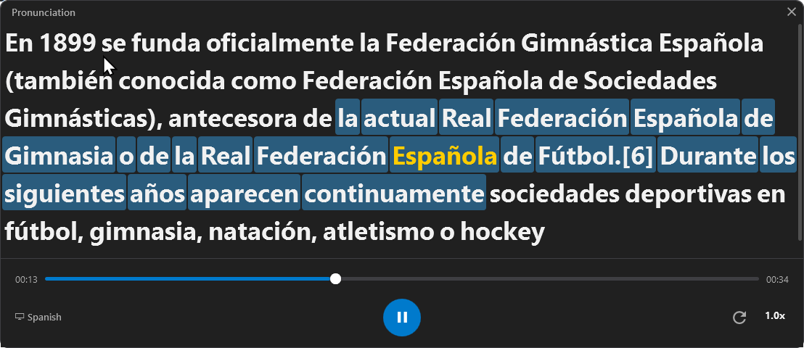

#  QuickTranslate

**Instant translation and pronunciation at your fingertips.**

QuickTranslate is a lightweight, high-performance .NET 8.0 WPF application designed for users who need fast, non-intrusive translations. Inspired by the best features of QTranslate, it offers a modern, sleek experience with powerful AI integrations.

---

## ✨ Features Breakdown

### 🎯 Instant Translation

Select any text in any application and press **Ctrl + Shift + T**. A beautiful, minimalist window appears instantly at your cursor position with the translation.

* **Multi-Provider Support**: Choose between Google, Bing, Yandex, and Microsoft.
* **Gemini AI Integration**: High-quality, context-aware translations.
* **Smart Positioning**: The window intelligently places itself near your cursor without covering important content.

### 🔊 Professional Pronunciation

Master any language with engaging pronunciation tool. press a button on your keyboard to see a deep dive into any word.

* **Syllable Breakdown**: See exactly how to break down complex words.
* **Phonetics (IPA)**: Accurate phonetic spellings for every word.
* **High-Quality Audio**: Crystal clear speech synthesis powered by modern AI.
* **Slow-Mo Playback**: Listen at 0.5x speed to catch every nuance.

---

🚀 Getting Started

1. **Download & Extract**: Grab the latest release from the [Releases](https://github.com/mostafa-elnahal/QuickTranslate/releases) page.
2. **Run**: Launch `QuickTranslate.exe`.
3. **Translate**: Select any text and hit `Ctrl + Shift + T` (or configure a custom hotkey in settings).

---

## ⚙️ Configuration

Right-click the **'T'** icon in your system tray and select **Options** to customize your experience:

* **Hotkeys**: Change shortcuts for translation and pronunciation.
* **Appearance**: Adjust opacity, font size, and themes.
* **API Keys**: Add your Gemini API key for premium AI translations.
* **Startup**: Enable "Start with Windows" for zero-friction access.

---

## 🛠️ For Developers

QuickTranslate is built with modern C# and WPF best practices:

- **Architecture**: MVVM with CommunityToolkit.Mvvm.
- **Dependency Injection**: Microsoft.Extensions.DependencyInjection.
- **Native Interop**: Efficient Win32 API calls via CsWin32.

---

## 📄 License

This project is licensed under the MIT License. See [LICENSE](LICENSE) for details.
